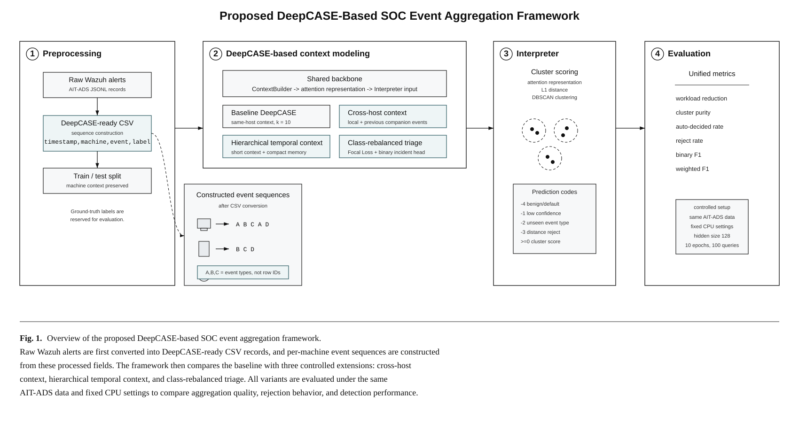
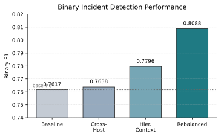
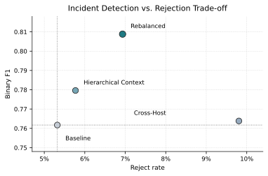
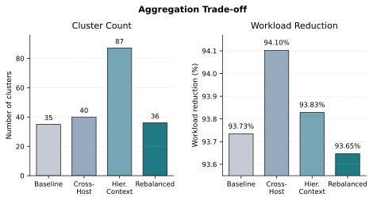

VI. Proposed Method

This project follows the DeepCASE workflow as the baseline and studies three controlled extensions: cross-host context, hierarchical temporal context, and class-rebalanced triage. The main design principle is to preserve the DeepCASE-style contextual modeling, attention-based representation, L1-distance clustering, and DBSCAN-based interpretation, while modifying one major design factor at a time. This keeps the method design focused: cross_host tests whether related hosts provide useful evidence, hierarchical_context tests whether longer temporal memory helps, and rebalanced tests whether imbalance-aware learning improves incident detection.

Fig. 1 summarizes the complete method pipeline used in this project. The raw AIT-ADS alerts are first converted into event sequences, then passed through a DeepCASE-based context modeling stage, interpreted by a clustering-based Interpreter, and finally evaluated with the same metrics across all variants. The three proposed extensions are placed inside the context modeling stage because they modify how contextual evidence is constructed, encoded, or optimized while keeping the overall DeepCASE-style workflow comparable.

Fig. 1. Overview of the proposed DeepCASE-based SOC event aggregation framework. Step 1 converts raw AIT-ADS Wazuh JSON alerts into DeepCASE-ready CSV records with timestamp, machine, event, and label fields, then constructs per-machine event sequences and the train/test split. The sequence callout connected to the CSV stage shows that event sequences are created after preprocessing, not directly from the raw JSON input. Step 2 shows the shared DeepCASE-style context-modeling backbone and the three controlled extensions: cross-host context, hierarchical temporal context, and class-rebalanced triage. Step 3 shows the Interpreter, which compares event-context representations using L1 distance, groups similar patterns with DBSCAN, and assigns cluster-level prediction scores. The prediction-code box summarizes the common DeepCASE-style cluster and rejection codes; it is not the full scoring path of the rebalanced binary triage head. Step 4 shows the evaluation protocol, where the reported runs use the same processed AIT-ADS data, fixed CPU settings, and common aggregation, rejection, and incident-detection metrics.

A. Baseline: DeepCASE Reproduction

As shown in Steps 1 to 3 of Fig. 1, the baseline implements a DeepCASE-style pipeline on the processed AIT-ADS event sequence. Each input record is represented by timestamp, machine, event, and label. Events are grouped by machine, and each target event is predicted from a fixed-length same-host context. In the reported experiment, the context length is 10, hidden size is 128, training uses 10 epochs, and the interpreter uses DBSCAN with eps = 0.1 and min_samples = 5.

The ContextBuilder learns an attention distribution over the preceding events and predicts the next event. The Interpreter then converts the attention-weighted context into an event-context representation and clusters similar patterns. During prediction, a sequence is automatically assigned only when the model confidence is at least the threshold 0.2 and the nearest cluster is within the DBSCAN distance constraint. Otherwise, it is rejected.

This project also separates ground-truth labels from model prediction codes. In AIT-ADS, the ground-truth label -1 means that an event is outside the attack interval and is therefore treated as benign or non-attack, while non-negative ground-truth labels identify the attack phase in the dataset. However, in the DeepCASE-style prediction output, negative values are also used to describe why the model cannot make a reliable automatic decision. If the same value -1 were used for both meanings, a benign event and a low-confidence prediction would be confused. To avoid this ambiguity, this project uses -4 as the benign/default cluster score in prediction results. The remaining negative prediction codes are reserved for rejection cases: -1 means low model confidence, -2 means an unseen event type during prediction, and -3 means that the nearest cluster is still farther than the distance threshold. In the prediction output, non-negative values such as 0, 1, and 2 are predicted cluster scores assigned by the interpreter; they use the same attack-phase ID space as the dataset labels for evaluation, but they are model outputs rather than ground-truth labels.

B. Cross-Host Context Variant

The cross_host variant, summarized in Step 2 of Fig. 1, addresses the limitation that the baseline only uses same-host history. In SOC environments, multi-stage attacks and lateral movement may generate related evidence across multiple machines. Therefore, this variant keeps the local same-host context but augments it with companion events collected from other hosts in the same scenario within a preceding time window. To avoid temporal leakage, only events that have already appeared before the current target event are eligible for the companion context.

The model uses two GRU streams: one for the local same-host context and one for the cross-host companion context. A gated fusion mechanism combines the two streams before attention and prediction. Importantly, the prediction target remains the original event type rather than a machine-event pair. This keeps the event vocabulary comparable to the baseline and prevents the model from over-fragmenting the event space. After representation learning, the method still uses the same DeepCASE-style L1 distance, DBSCAN clustering, and interpreter logic.

C. Hierarchical Temporal-Context Variant

The hierarchical_context variant is the second controlled extension in Step 2 of Fig. 1. It addresses the limitation of using only a short fixed-length context window. Some security incidents involve earlier precursor events that may fall outside the immediate local window. Simply increasing the context length may introduce noise and increase CPU cost, so this project uses a hierarchical design instead.

This variant separates the input into short-term context and compact long-term memory. The short-term branch preserves recent local behavior, while the long-term branch stores selected earlier events using a recent-distinct memory strategy. Two GRU encoders process the two parts separately, and a gated fusion mechanism combines them before attention and event prediction. This design tests whether broader temporal evidence can improve DeepCASE-style clustering and prediction while remaining closer to the original GRU-based architecture than a full Transformer replacement.

D. Class-Rebalanced Triage Variant

The rebalanced variant is the third controlled extension in Step 2 of Fig. 1. It addresses the class imbalance problem in security event learning. In AIT-ADS, benign or low-risk events are much more frequent than rare incident-related events. A model trained only to predict the next event may learn representations dominated by majority patterns. To reduce this effect, the rebalanced variant adds an incident-triage head to the original next-event prediction objective.

The reported rebalanced run uses Focal Loss for the incident-triage head. Focal Loss reduces the influence of easy examples and focuses learning on harder cases, which is useful under imbalanced data. Weighted binary loss is implemented as an optional alternative but is not used as the training loss in the reported run. However, the positive and negative class weights are still used during cluster-level posterior estimation. During prediction, the method combines cluster prior, model confidence, and distance-based rejection to produce a calibrated binary decision: benign, incident, or reject. Unlike the baseline and the two context variants, the rebalanced variant is evaluated primarily as binary incident triage rather than multiclass attack-type classification.

E. Metrics and Terminology

Step 4 of Fig. 1 shows the unified evaluation stage. The experiments evaluate two kinds of behavior: whether the method can aggregate many alerts into fewer analyst-review units, and whether it can correctly prioritize incident-related events. The metrics are defined as follows.

Clusters is the number of valid DBSCAN clusters produced during training. Unclustered or noise samples are not counted as clusters. This metric shows how many analyst-review groups the model creates.

Workload reduction estimates how much manual inspection is reduced after clustering. This project follows the assumption that an analyst inspects a fixed number of representative samples from each cluster. With 10 representative samples per cluster, the overall workload reduction is computed as:

`1 - (10 * number_of_clusters + number_of_unclustered_sequences) / number_of_training_sequences`.

Cluster purity measures whether samples inside the same cluster mostly share the same evaluation label. For each cluster, the majority label count is selected, and all majority counts are summed over clusters. The purity score is:

`sum(majority_label_count_in_each_cluster) / number_of_clustered_sequences`.

Auto-decided rate measures prediction coverage. It is the proportion of test events that receive a non-rejected prediction:

`number_of_non_rejected_predictions / number_of_test_predictions`.

Reject rate is the opposite side of the same decision behavior. It is the proportion of test events for which the model refuses to make an automatic decision because of low confidence, unseen event type, excessive distance from the nearest cluster, or the rebalanced reject rule:

`number_of_rejected_predictions / number_of_test_predictions`.

Binary F1 is the main incident-detection metric in this project. It evaluates benign-versus-incident triage, where the AIT-ADS label -1 is treated as benign and all non-negative attack labels are treated as incident-related. Precision asks: among events predicted as incidents, how many are truly incident-related? Recall asks: among truly incident-related events, how many were detected? F1 is their harmonic mean:

`F1 = 2 * precision * recall / (precision + recall)`.

Rejected predictions are not forced into the binary F1 confusion matrix. Instead, binary F1 is interpreted together with reject rate. This prevents a method from looking better simply because it rejects many difficult samples.

Weighted F1 is reported for multiclass attack-type prediction when applicable. It computes F1 for each attack label and averages them according to the number of true samples in each class:

`weighted_F1 = sum(class_F1 * class_support) / sum(class_support)`.

This metric is useful when classes are imbalanced, but it should be interpreted carefully because frequent classes have larger influence. In this project, weighted F1 is reported for the baseline, cross_host, and hierarchical_context variants because they output multiclass cluster scores. It is not reported for rebalanced because the reported rebalanced method is designed as binary incident triage rather than attack-type classification.

F. Experimental Assumptions and Scope

Several assumptions define the scope of the reported experiments. First, this project evaluates the event-sequence modeling pipeline after AIT-ADS alerts have been converted into the DeepCASE-ready format. Each usable record is assumed to contain the required fields: timestamp, machine, event, and label. During raw-data conversion, records without the required timestamp, agent, or rule information are skipped rather than imputed. Therefore, this work does not study missing-field recovery or raw alert repair.

Second, the event representation is intentionally compact. The event token is derived from the alert rule ID, and the machine identifier is derived from the scenario and agent ID. Other raw alert attributes, such as message text, IP addresses, user names, severity fields, and payload-level details, are not used in the reported models. This keeps the comparison focused on DeepCASE-style event-sequence context modeling.

Third, the AIT-ADS attack-interval labels are treated as the ground truth for evaluation. Events outside attack intervals are assigned label -1 and treated as benign or non-attack. Non-negative labels are treated as attack-phase labels. These labels are used for evaluation and cluster-score interpretation. In the rebalanced variant, the same labels are additionally converted into a binary benign-versus-incident target for the incident-triage head.

Fourth, all context construction follows a temporal no-leakage assumption. The baseline, rebalanced, and hierarchical_context variants use only previous events from the same machine for their local context. The cross_host variant uses the same local context and additionally uses only previous events from other machines in the same scenario within the configured look-back window. Future events are not used to construct the context of the current target event.

Fifth, the reported runs use the same processed AIT-ADS data source, CPU setting, hidden size 128, 10 training epochs, 100 query iterations, DBSCAN configuration, and evaluation metrics. The train/test construction is not identical in every implementation: baseline and rebalanced use the processed-file-order sequential split after DeepCASE preprocessing, while cross_host and hierarchical_context explicitly sort the processed events by timestamp before splitting. Therefore, the baseline-versus-rebalanced comparison is the strictest internal comparison, and the two context variants should be interpreted as supporting ablations. The reported results are formal CPU runs under fixed configurations, not a large hyperparameter search or multi-seed robustness study.

Finally, workload reduction is an estimated triage-effort metric rather than a direct human-subject measurement. It assumes that an analyst inspects 10 representative samples per cluster and that unclustered or rejected cases require further attention. Therefore, the workload metric should be interpreted as a controlled proxy for SOC analysis effort, not as a measured analyst time reduction.

VII. Results

All formal runs use the same processed AIT-ADS data and the same train/test event counts: 520,052 training events and 2,080,211 testing events. The baseline and rebalanced runs share the same processed-file-order sequential split. The cross_host and hierarchical_context runs use the same processed data and split ratio, but their sequence builders explicitly sort the events by timestamp before splitting. All reported runs use 10 training epochs, hidden size 128, and 100 query iterations. The main metrics are the number of clusters, workload reduction, cluster purity, auto-decided rate, reject rate, binary F1, and weighted F1.

Table 1 summarizes the formal results.

Table 1. Formal Result Comparison on AIT-ADS

| Method | Clusters | Workload Reduction | Cluster Purity | Auto-Decided Rate | Reject Rate | Binary F1 | Weighted F1 |
| --- | ---: | ---: | ---: | ---: | ---: | ---: | ---: |
| Baseline | 35 | 0.9373 | 0.9874 | 0.9468 | 0.0532 | 0.7617 | 0.0055 |
| Cross-Host | 40 | 0.9410 | 0.9799 | 0.9019 | 0.0981 | 0.7638 | 0.0006 |
| Hierarchical Context | 87 | 0.9383 | 0.9792 | 0.9423 | 0.0577 | 0.7796 | 0.0066 |
| Rebalanced | 36 | 0.9365 | 0.9875 | 0.9307 | 0.0693 | 0.8088 | N/A |

A. Baseline Result

As shown in Table 1, the baseline DeepCASE run produces 35 clusters. It achieves high workload reduction of 0.9373 and high cluster purity of 0.9874, showing that the baseline successfully aggregates many events into a small number of clusters. Its binary F1 is 0.7617, which serves as the main reported reference point for Fig. 2 and Fig. 3. The strictest direct comparison is with rebalanced, because both runs use the same final split construction. The baseline also has an auto-decided rate of 0.9468 and a reject rate of 0.0532. This confirms that DeepCASE-style clustering is effective for workload reduction, but leaves room for improvement in incident prioritization.

B. Cross-Host Result

Table 1 and Fig. 4 show that the cross_host variant produces 40 clusters and achieves the highest workload reduction among the reported runs, with an overall reduction of 0.9410. However, Fig. 2 shows that its binary F1 is 0.7638, only slightly higher than the reported baseline value by 0.0021. Fig. 3 further shows the cost of this small difference: its reject rate increases to 0.0981, and cluster purity decreases to 0.9799. Because this variant uses a timestamp-sorted sequence construction, the result should be interpreted as a supporting workload and context ablation rather than as the main strict baseline comparison.

C. Hierarchical-Context Result

As shown in Table 1 and Fig. 2, the hierarchical_context variant reaches binary F1 of 0.7796, which is 0.0179 higher than the reported baseline value. Fig. 3 shows that this result is achieved with a reject rate of 0.0577, close to the baseline, and Table 1 shows that its auto-decided rate remains high at 0.9423. However, Fig. 4 shows that the method produces 87 clusters, much more than the baseline. Its cluster purity also decreases to 0.9792. This suggests that hierarchical temporal memory can help binary incident detection, but it also creates a more fragmented cluster space. Because this variant uses timestamp-sorted sequence construction, the result supports the usefulness of longer temporal context as an ablation, but the design still requires stricter split-controlled validation and better control of cluster fragmentation.

D. Rebalanced Result

Table 1 shows that the rebalanced variant produces 36 clusters, which is close to the baseline's 35 clusters. Its cluster purity is 0.9875, slightly higher than the baseline, and Fig. 2 shows that its binary F1 reaches 0.8088. This is the largest reported binary-F1 improvement, with an absolute gain of 0.0471 over the baseline under the same final split construction. Its precision is 0.7089 and recall is 0.9415, showing that it detects most incidents while improving the balance between incident and benign decisions. Fig. 3 shows that this improvement comes with a moderate reject-rate increase from 0.0532 to 0.0693. Although Fig. 4 shows a small workload-reduction decrease from 0.9373 to 0.9365, the binary-F1 improvement makes rebalanced the strongest proposed method in the formal experiments.

E. Result Interpretation

The reported results show that the three extensions affect different aspects of the pipeline. Cross_host mainly improves workload reduction, but its higher reject rate means that the model becomes less confident. Hierarchical_context reaches a higher binary F1 than the reported baseline while keeping reject rate close to the baseline, but it increases the number of clusters. Rebalanced gives the clearest and strictest improvement in binary incident detection because it shares the baseline split construction while preserving cluster count and cluster purity close to the baseline.

The results also show that binary incident triage is more achievable than detailed attack-type classification. The weighted F1 scores for multiclass attack-type prediction remain low for the DeepCASE-style cluster-scoring variants. This does not invalidate the binary triage result; it shows that identifying whether an event is incident-related is easier than assigning the exact attack phase under sparse and imbalanced labels.

Figs. 2 to 4 visualize these findings from three perspectives: incident-detection performance, the trade-off between F1 and rejection, and aggregation behavior. These figures are used together with Table 1 because the best method should not be selected by a single metric alone.

Fig. 2. Binary F1 comparison of the baseline and proposed variants. Rebalanced achieves the highest binary incident-detection performance, improving binary F1 from 0.7617 to 0.8088 under the same baseline split construction. Hierarchical_context also reaches a higher reported F1 value, while cross_host provides only a marginal F1 difference.

Fig. 3. Trade-off between binary F1 and reject rate. The dotted reference lines indicate the baseline values. Rebalanced achieves the best binary F1 with a moderate reject-rate increase, while cross_host has a much higher reject rate with only a small F1 improvement.

Fig. 4. Aggregation trade-off measured by cluster count and workload reduction. Cross_host achieves the highest workload reduction, but its detection improvement is limited. Hierarchical_context creates more clusters, indicating stronger representation fragmentation. Rebalanced keeps the cluster count close to the baseline while improving binary incident detection.

VIII. Comparison

A. Fairness of Comparison

This project treats quantitative comparison as reliable only when the compared methods are evaluated under the same AIT-ADS data, compatible event representation, matched train/test construction, and the same evaluation metrics. This is important because log anomaly detection results are highly sensitive to data grouping, label distribution, train-test construction, and noise [6]. Under this standard, the strongest direct comparison in this report is between the reproduced DeepCASE baseline and the rebalanced variant, because both use the same processed-file-order sequential split. The cross_host and hierarchical_context variants use the same processed data, split ratio, model budget, and evaluation metrics, but they explicitly sort events by timestamp before splitting; therefore, they are reported as supporting context ablations rather than as fully split-controlled replacements for the baseline.

Existing methods such as DeepLog, LogAnomaly, LogBERT, EULER, and LogGD are compared mainly by research objective and modeling design, not by directly copying their reported scores. Their published numbers are usually obtained on different datasets such as HDFS, BGL, or Thunderbird, and often use anomaly-detection metrics rather than SOC workload-reduction and DeepCASE-style cluster interpretation. Directly placing those numbers beside AIT-ADS results would be misleading.

B. Quantitative Comparison with the Baseline

Table 2 reports the quantitative changes of each proposed variant relative to the reproduced DeepCASE baseline. The rebalanced row is the strictest direct comparison because it shares the baseline split construction. The cross_host and hierarchical_context rows are reported-run deltas and should be interpreted together with the split-policy caveat.

Table 2. Delta Relative to Reported Baseline Values

| Method | Role | Delta Workload Reduction | Delta Cluster Purity | Delta Reject Rate | Delta Binary F1 | Interpretation |
| --- | --- | ---: | ---: | ---: | ---: | --- |
| Cross-Host | Context ablation | +0.0037 | -0.0075 | +0.0448 | +0.0021 | Better aggregation, but more rejection and almost no F1 gain |
| Hierarchical Context | Temporal ablation | +0.0009 | -0.0082 | +0.0045 | +0.0179 | Moderate binary-F1 gain, but more cluster fragmentation |
| Rebalanced | Main proposed method | -0.0009 | +0.0001 | +0.0161 | +0.0471 | Best incident-detection improvement with stable cluster quality |

As summarized in Table 2, rebalanced is the strongest method. It improves binary F1 by 0.0471 while keeping cluster purity nearly unchanged under the same split construction as the baseline. Hierarchical_context provides a smaller reported binary-F1 gain, and cross_host improves workload reduction but does not substantially improve incident detection. Therefore, the evidence supports rebalanced as the primary proposed method and the two context variants as supporting ablations.

C. Comparison with DeepCASE

Compared with the original DeepCASE paper, this project keeps the same core idea: contextual security event triage through attention-based representation and cluster-level interpretation [1]. The reproduced baseline confirms that this style of aggregation is effective for AIT-ADS, achieving more than 93% workload reduction. The added -4 benign cluster code is an implementation-level clarification that separates benign/default clusters from rejection codes such as low confidence, unseen event type, and excessive cluster distance. This preserves the DeepCASE-style workflow while making the prediction report easier to interpret.

The proposed variants extend DeepCASE in three controlled directions. Cross_host tests whether same-scenario other-host evidence helps. Hierarchical_context tests whether a compact long-term memory helps. Rebalanced tests whether class imbalance should be handled explicitly. The formal results show that the clearest strict improvement comes from rebalanced triage, not from context expansion alone. This suggests that, on the reported AIT-ADS setting, imbalance is a stronger bottleneck than missing context.

D. Comparison with Log Sequence Anomaly Detection Methods

DeepLog, LogAnomaly, and LogBERT are relevant because they also model log sequences [3]-[5]. However, their usual objective is anomaly detection: deciding whether a sequence is normal or abnormal. This differs from the SOC triage objective in this project, which requires event aggregation, analyst workload reduction, reject handling, and interpretable cluster-level results.

Some open-source implementations exist. LogDeep provides DeepLog and LogAnomaly-style models and reports example HDFS benchmark scores such as DeepLog F1 0.9454 and LogAnomaly F1 0.9757 on HDFS. LogBERT's repository provides pipelines for HDFS, BGL, and Thunderbird. LogADEmpirical provides implementations of DeepLog, LogAnomaly, PLELog, LogRobust, and CNN for log anomaly detection experiments. These repositories are useful references, but they are not directly comparable to this project without adaptation because they assume log-key sequence datasets and anomaly-detection protocols rather than AIT-ADS SOC triage.

Table 3 summarizes the comparison boundary.

Table 3. Comparison with Existing Log Anomaly Methods

| Method Family | Typical Dataset in Existing Work | Main Output | Directly Comparable to This Project? | Reason |
| --- | --- | --- | --- | --- |
| DeepLog / LogAnomaly | HDFS, BGL, Thunderbird | Sequence anomaly score or anomaly label | No, unless re-run on AIT-ADS | Different dataset, grouping protocol, and objective |
| LogBERT | HDFS, BGL, Thunderbird | Transformer-based anomaly score | No, unless re-run on AIT-ADS | Requires log-template pipeline and different training objective |
| LogADEmpirical baselines | Public system-log datasets | Log anomaly detection metrics | No, unless adapted | Focuses on system-log anomaly detection, not cluster-based SOC triage |
| This project | AIT-ADS | Clusters, reject-aware triage, workload reduction, binary F1 | Yes, internally with caveat | Same data, metrics, and DeepCASE-style pipeline; strictest split-controlled claim is baseline versus rebalanced |

Therefore, this report does not claim that the proposed methods outperform DeepLog, LogAnomaly, or LogBERT in general. The correct claim is narrower and experimentally fair: under the reproduced AIT-ADS DeepCASE-style SOC triage pipeline and the same baseline split construction, the rebalanced variant outperforms the reproduced DeepCASE baseline in binary incident detection.

E. Comparison with Graph-Based and Cross-Entity Methods

Graph-based methods such as EULER and LogGD show that relationships among hosts, entities, and events can be useful [7], [8]. However, a full graph model would require explicit graph construction, edge definitions, graph-specific tuning, and a different explanation mechanism. This project intentionally avoids that change in order to isolate the effect of adding cross-host evidence within the DeepCASE pipeline.

The cross_host result shows both the promise and limitation of this lightweight approach. It improves workload reduction from 0.9373 to 0.9410, but binary F1 only increases from 0.7617 to 0.7638 and reject rate increases from 0.0532 to 0.0981. This means that simple companion context is not enough to fully model multi-host attack structure. Future work may need graph-based relation modeling, but that should be evaluated as a separate model family with a carefully matched AIT-ADS protocol.

F. Comparison with Imbalance-Aware Learning

Focal Loss, Class-Balanced Loss, and LDAM show that loss design matters under long-tailed or imbalanced data [9]-[11]. The rebalanced variant adapts this principle to DeepCASE-based SOC triage. Instead of replacing the full pipeline, it adds an incident-triage objective and uses cluster-level posterior calibration.

This direction gives the strongest formal result. Rebalanced improves binary F1 from 0.7617 to 0.8088, while cluster purity remains nearly unchanged at 0.9875. This supports the interpretation that class imbalance is a central limitation in the baseline. It also explains why adding more context alone is not sufficient: if the representation and scoring policy are still dominated by majority patterns, rare incident signals remain difficult to prioritize.

G. Whether External Baselines Should Be Run

For a strict research comparison, external baselines should be run only if the following variables are controlled: same AIT-ADS processed events, same train/test split, same binary incident labels for final evaluation, same no-leakage rule, same context/window construction policy, and same metrics. Without this control, the comparison would be a dataset-and-protocol comparison rather than a model comparison.

The closest downloadable candidates are LogDeep, LogBERT, and LogADEmpirical. They can be downloaded, but they cannot be used as immediate plug-and-play AIT-ADS baselines. To use them fairly, an adapter must convert AIT-ADS into their expected log-key window format, define anomaly labels from AIT-ADS attack intervals, preserve the same train/test split, and output predictions that can be evaluated with the same binary F1 and reject/workload metrics. This is feasible as future work, but it is not a safe last-minute experiment for the current report.

IX. Conclusion

This project studied whether a DeepCASE-style SOC event aggregation pipeline can be improved on AIT-ADS without replacing its interpretable ContextBuilder-Interpreter structure. The work reproduced a baseline DeepCASE pipeline, clarified the prediction-code design by separating benign/default clusters from rejection codes, and evaluated three targeted extensions: cross-host context, hierarchical temporal context, and class-rebalanced triage.

The main finding is that class-rebalanced triage gives the clearest improvement. Under the same processed-file-order sequential split as the reproduced baseline, the rebalanced variant improves binary F1 from 0.7617 to 0.8088. At the same time, it keeps the cluster count close to the baseline, 36 clusters compared with 35, and preserves high cluster purity, 0.9875 compared with 0.9874. Its reject rate increases moderately, from 0.0532 to 0.0693, but the incident-detection gain is larger than this cost. This result suggests that class imbalance is a major bottleneck in the reproduced DeepCASE-style triage pipeline.

The two context-extension variants are useful but should be interpreted as supporting ablations. The hierarchical_context variant reaches binary F1 of 0.7796, which suggests that longer temporal evidence can help, but it also increases the number of clusters to 87 and lowers cluster purity. The cross_host variant achieves the highest workload reduction, 0.9410, but only gives a marginal binary-F1 difference and increases reject rate to 0.0981. Since these two variants explicitly sort events by timestamp before splitting, while baseline and rebalanced use the processed-file-order sequential split, they are not the strongest basis for the main claim.

The contribution of this project is therefore twofold. First, it shows that DeepCASE-style clustering remains useful for reducing SOC analysis workload while keeping the result interpretable. Second, it shows that workload reduction, rejection behavior, cluster quality, and binary incident detection must be interpreted together. A method may aggregate alerts well without improving incident prioritization, while another method may improve detection at the cost of more rejected cases.

Several limitations remain. The experiments use a compact Wazuh-based AIT-ADS representation and do not use richer raw alert fields. The current split policy is also not fully unified across all variants, so the context-extension results should be treated carefully. In addition, multiclass attack-type weighted F1 remains low, which means the current models are stronger at benign-versus-incident triage than detailed attack-phase classification. The experiments are CPU-based fixed-configuration runs, not a multi-seed robustness study or large hyperparameter search. Finally, external baselines such as DeepLog, LogAnomaly, and LogBERT were not re-run on AIT-ADS because a fair comparison would require a separate adapter and matched evaluation protocol.

Future work should first unify all variants under a single timestamp-sorted AIT-ADS split. It should also improve threshold calibration, cross-host relation modeling, long-context selection, and multi-seed evaluation. A second direction is to adapt external log anomaly detection baselines to the same AIT-ADS protocol, so that DeepCASE-style SOC triage can be compared against general log anomaly detection methods under the same data, labels, and metrics.

In conclusion, the most defensible result of this project is that the class-rebalanced DeepCASE extension improves binary incident triage while preserving the interpretable clustering structure of the baseline. Cross-host and hierarchical temporal context remain promising directions, but they require stricter split control and better handling of noise, fragmentation, and rejection behavior before they can serve as the main improvement claim.
