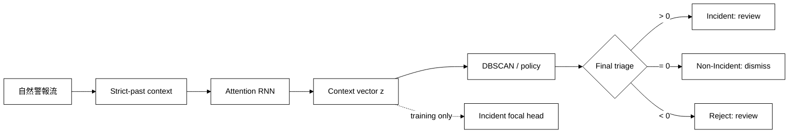
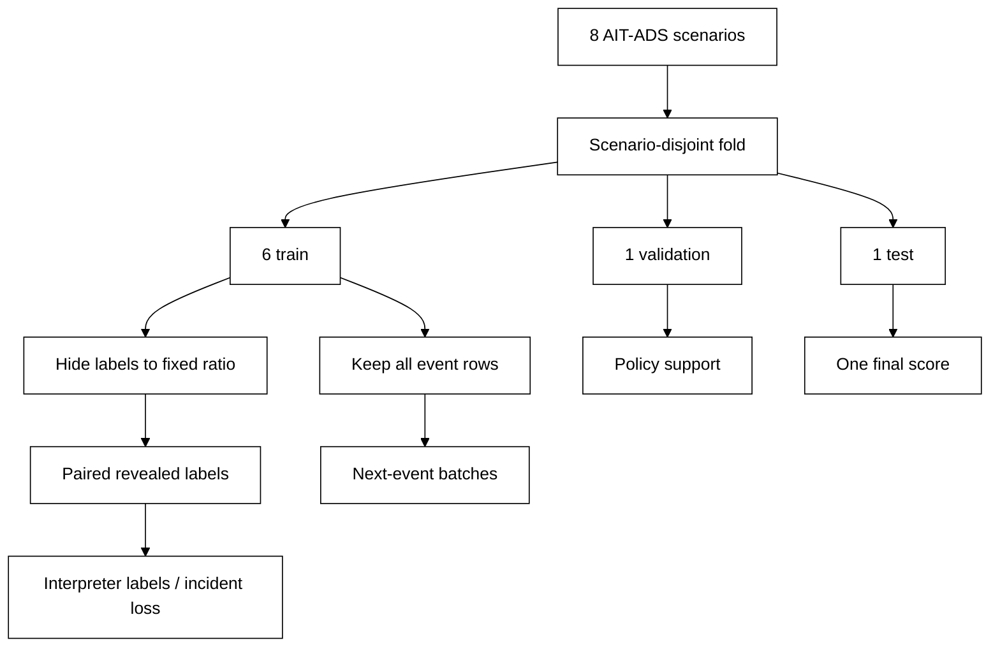

# 在自然警報流與固定偵測規則下評估 DeepCASE 的 Incident-aligned 不平衡學習

## 摘要

本研究探討：在不關閉既有 noisy detection rules、不刪除重複警報、保留自然事件流與自然測試盛行率的條件下，對 DeepCASE 加入 incident-aligned、imbalance-aware representation learning，能否在極端訓練標籤不平衡下，以不高於原始 DeepCASE 的警報審查量取得較高 incident recall。研究使用公開 AIT Alert Data Set（AIT-ADS）的 2,655,821 筆警報與八個攻擊情境；極端不平衡只施加於訓練階段可見標籤，不改動事件流、驗證集或測試集。本方法在原有 next-event objective 外，對實際送入 Interpreter 分群的 attention-weighted context vector 加入 training-only incident focal objective，並以類別平衡、incident-group 平衡批次訓練。部署時仍使用 DeepCASE 的 Incident／Non-Incident／Reject 三種語意，未重做 Reject。

主要 q=0 確認性實驗為六個 scenario-disjoint folds、三個 seeds、1:1000 負正標籤比。相對 DeepCASE，本方法的情境等權平均 IncidentRecall@matched-workload 差為 +0.00586，平均 workload 差為 −0.00605；95% scenario bootstrap CI 為 [−0.00391, 0.01642]，單尾 exact sign-flip p=0.1875，因此不能宣稱穩健提升。考量原始 DeepCASE 的 attention-query 預設為 100 iterations，本研究在看見 q=100 確認結果前另行凍結 rescue protocol：先以兩個 design scenarios 選法，再只用 group-balanced focal 方法執行六情境、三 seeds 的 q=100 重評估。36/36 個確認紀錄均通過 fail-closed 稽核，但 matched-workload 只有 17/18 配對可行；可用配對的描述性情境等權差為 recall −0.00835、workload −0.00431，且六情境僅 wheeler 小幅正向。因一個 planned pair 不可行，確認性 estimand 不完整，正式 CI／p-value 不計算。替代 window label 與 training-defined ambiguous-rule 診斷也未支持改善。原有 119 筆結果加上新增 q=100 design／確認結果 42 筆，共 161/161 紀錄通過對應稽核。本研究因此不能支持 proposed 優於 DeepCASE；可成立的貢獻是可重現的 label-scarcity／workload 評估、清楚的新穎性邊界、Interpreter 索引錯誤的共同修正，以及揭露此方法在 q=0、q=100 與替代 label 下皆缺乏穩健證據。

## 1. 介紹

### 1.1 問題來源

SOC 上游規則產生警報，DeepCASE 等後處理器再利用事件脈絡決定哪些警報可自動忽略、哪些需交由分析人員。上游 ruleset tuning 與下游 imbalance-robust learning 都可能有用，但兩者回答不同問題：

- ruleset tuning 問的是「哪些規則應停用、修改或降噪」；
- 本研究問的是「給定同一套規則與同一事件流，後處理方法是否更能承受 incident labels 稀少」。

若模型 A 使用原始 noisy rules、模型 B 卻先依測試結果刪除壞 rules，差異同時包含 ruleset 與模型，無法歸因。因此主要實驗固定 rules 並非主張壞規則不該刪，而是必要的因果控制。ruleset tuning 應作為另一個 factorial intervention 或後續研究，不可偷偷混入本比較。

### 1.2 研究問題與假設

主要研究問題為：

> 在 detector rules、自然警報流與自然測試盛行率不變時，incident-aligned、imbalance-aware representation learning 是否能在 1:1000 訓練標籤不平衡下，以不高於 DeepCASE reference 的 review workload，提高 held-out scenario 的 incident recall？

令每個 confirmatory scenario 先對三個 seeds 的差值取平均，再令

\[
\Delta_s = R^{\text{proposed}}_s(B_s)-R^{\text{DeepCASE}}_s(B_s),
\]

其中 \(B_s\) 是同一情境中 DeepCASE 預設 operating point 所產生的審查率。假設為：

\[
H_0:E_s[\Delta_s]\le 0,\qquad H_1:E_s[\Delta_s]>0.
\]

α 固定為 0.05。未拒絕 \(H_0\) 不等於證明兩者完全相同；它只表示現有六個獨立情境不足以支持正向主張。

### 1.3 研究貢獻

1. 建立不刪事件、只隱藏訓練 labels 的極端 label-scarcity protocol。
2. 將 incident supervision 施加於 Interpreter 實際使用的 context representation，而非僅把 focal loss 套到 next-event task。
3. 明確保留 Incident／Non-Incident／Reject，並把 Incident 與 Reject 都計入 review workload。
4. 使用 scenario-disjoint evaluation、paired label reveals、scenario-level inference 與 fail-closed 結果驗證。
5. 重現並修正兩個會交換／錯置 Interpreter label 的上游 indexing 問題，且對所有方法使用相同修正。

## 2. 相關論文探討

### 2.1 DeepCASE

van Ede 等人提出的 DeepCASE 以 attention-based Encoder–Decoder RNN 學習事件前文，再以 attention vector、DBSCAN 與少量分析人員 policy labels 做半監督式分群與處置。它的優點是只需離散事件 ID、可利用大量未標記事件、保有 cluster/context 解釋介面，且與本研究欲固定的部署流程一致。缺點是 ContextBuilder 的 next-event objective 並不直接等於 SOC 的 incident-at-workload 目標，且 Interpreter 成效會受標籤分布、分群與 Reject 共同影響。

### 2.2 Ruleset tuning 與 imbalance

Teuwen 等人的 2025 DeepCASE case study 顯示 ruleset tuning 可顯著降低不平衡與工作量，並改善後處理效果。這支持「上游資料品質很重要」，但不排除研究固定 rules 時的下游韌性。相關碩士研究曾把 focal KL loss 套到 DeepCASE 的事件預測 loss，未得到一致改善；那不等同於本研究，因為本研究保留 next-event loss，另外對 incident label 與部署 representation 建立 auxiliary objective。然而本研究完成後同樣沒有得到穩健改善，故能主張的是「測試了不同的 focal 作用位置且結果仍不支持穩健增益」，不能把既有負面結果改寫成新方法已解決問題。

### 2.3 不平衡學習

Focal loss 以 \((1-p_t)^\gamma\) 降低容易樣本的權重，避免大量容易負例主導梯度。Class-balanced loss 則用 effective number of samples 調整類別權重。本研究的最終 proposed 方法不重複校正：supervised mini-batch 先做 1:1 class balance，因此 focal loss 使用 α=0.5；正例再依 incident group 均勻抽樣，避免單一高流量 attack group 壟斷正例梯度。

### 2.4 為何沒有把 Transformer／graph 當主要 baseline

本研究不是要證明 RNN 優於所有序列模型，而是在固定 DeepCASE architecture 與 deployment policy 時，識別 training-objective 改動的效果。若同時換成 Transformer 或 graph model，結果無法判斷來自 objective 或 architecture。LogBERT 類 Transformer 能學雙向長距序列，但通常回答 log anomaly detection，未天然提供 DeepCASE 的少標籤 cluster-policy 與 Reject 語意；graph／provenance 方法可表達 entity-causality，但需要 process、network entity、edge 或 vulnerability knowledge，而本研究的標準化輸入只有 detector-event sequence。故本研究納入原始 DeepCASE、training-objective ablations 與強 rule-prior baseline，並把 architecture comparison 限定為未來獨立 RQ。這能回覆方法合理性，但不能宣稱 attention RNN 是全域最佳架構。

| 方法族 | 主要輸入／假設 | 優點 | 與本研究主要比較不等價的原因 |
| --- | --- | --- | --- |
| Rule posterior | 當前 detector rule 與少量 labels | 極簡、強、可稽核 | 不使用前文；用來檢查 context 是否真的增加價值 |
| 傳統 clustering | event-count／距離 | 計算便宜 | 順序資訊有限，且仍需定義 cluster policy |
| DeepCASE RNN | 事件序列、少量 policy labels | 與既有流程／Reject 相容 | 本研究的受控 backbone |
| Transformer | 大量序列、自監督任務 | 長距依賴、平行訓練 | 通常 objective／決策語意不同 |
| Graph correlation | entities、edges、因果或 provenance | 適合多步攻擊關聯 | AIT-ADS 標準序列介面未提供完整圖結構 |

### 2.5 文獻範圍與新穎性邊界

本研究核對 DeepCASE 原論文、2025 ruleset/data-imbalance case study、相關碩士研究、AIT-ADS 論文與資料說明，以及 focal/class-balanced loss 與 LogBERT 原始文獻。就這些直接相關來源，未見把 binary incident supervision 直接施加於 DeepCASE Interpreter 所使用的 attention-weighted representation，並在保留 Reject 與自然 test stream 下以 matched workload 做 scenario-level 檢定的相同組合。然而這不是系統性文獻回顧，不能邏輯上證明「所有既有文獻都沒有」；論文應使用「在本研究檢索的直接相關文獻中未見」而非絕對首創宣稱。

## 3. 背景知識

### 3.1 Training Objective 不等於 Final SOC Objective

原始 ContextBuilder 最小化的是「由前文預測下一個 event ID」的 loss：

\[
L_{event}=CE_\text{smooth}(\hat e_t,e_t).
\]

這會學到常見事件順序，但 SOC 真正在意的是有限人力下不要漏掉 incident：

\[
\max_\theta \operatorname{IncidentRecall}(\theta)
\quad\text{s.t.}\quad
\operatorname{ReviewRate}(\theta)\le B.
\]

兩者不相同：一個事件可容易預測卻是 incident，也可難以預測卻只是 benign noise。標籤極不平衡時，next-event task 更可能被常見事件主導，所以 mismatch 更值得檢驗。

### 3.2 Incident-aligned objective

本研究令 \(z_t\) 為 attention 對前 10 個事件的加權 event-count vector；這是 Interpreter 後續 vectorize／cluster 的表示。主 q=0 實驗直接使用模型前向 attention；q=100 rescue 則依已觀察到的 target event 再做 100 次 attention-query optimization，對齊上游 DeepCASE 預設。訓練時加上 binary incident head：

\[
L=L_{event}+\lambda L_{incident}^{focal},\qquad \lambda=0.5,\ \gamma=2.
\]

binary head 只提供梯度來塑形 \(z_t\)，部署時移除。因此它不負責產生 Reject，也沒有把三分類簡化成二分類。

### 3.3 Final triage 與 Reject

Interpreter score 的操作語意固定為：

- score > 0：Incident，送審；
- score = 0：Non-Incident，自動略過；
- score < 0：Reject，因低信心、未知 event 或距離過遠而送審。

故

\[
Workload=\frac{\#Incident\ decision+\#Reject}{\#alerts},
\]

而 IncidentRecall@Workload 是「真實 incident 中被送審的比例」。這是 alert-review-rate proxy，不是實測分析分鐘數。

## 4. 資料集

### 4.1 選擇 AIT-ADS 的原因

AIT-ADS 可由 Zenodo 公開直接下載，包含八個具有變化的 multi-step attack scenarios，警報來自 Suricata、Wazuh 與 AMiner，並含大量由正常行為造成的 false positives、異質 alert formats 與 attack-phase labels。這比只含單一 log source 或已先清理 alerts 的資料更接近本研究「保留 noisy rules」的問題。

### 4.2 資料稽核

正式輸入使用作者發布的 alert CSV，而非 legacy `ait_ads_deepcase.csv`；後者漏掉全部 AMiner alerts，並把 Suricata signatures 錯誤折疊成 Wazuh wrapper rule 86601。

| 項目 | 數值 |
| --- | ---: |
| Alerts | 2,655,821 |
| Stable detector-event types | 75 |
| Scenarios | 8 |
| Scenario-qualified machines | 94 |
| Event-label incident prevalence | 68.425% |
| Window-label incident prevalence | 66.442% |
| Strict-past empty contexts | 627 |

AIT-ADS 的 incident 在自然資料中其實是多數類。因此本研究只能主張「對極端 training-label scarcity 的韌性」，不能聲稱已在自然 incident prevalence 為 0.1% 的真實 SOC 上獲證。1:10、1:100、1:1000 是 revealed training labels 的負正比；所有未揭露事件仍參與 next-event learning，validation/test 完整保留。

### 4.3 Label 定義

主要 label `event_incident` 表示該 alert 本身是否對應攻擊；敏感度 label `window_incident` 表示落入攻擊時間窗。兩者有 91,755 筆不一致，不能任意替換。event label 是主要分析，window label 僅作 sensitivity analysis。

## 5. 實作方法

### 5.1 資料處理與防洩漏

1. 依 scenario、host、timestamp 排序。
2. context 僅含同 scenario-qualified host、24 小時內、嚴格早於當前 timestamp 的最多 10 個 events；同秒 alerts 彼此不可見。
3. 每 fold 留一個完整 scenario 作 test、另一個作 validation，其餘六個作 train。
4. vocabulary 只由 training scenarios 建立；test-only events 映射為 UNK 並保留 Reject 可能性。
5. 不刪 duplicate alerts；multiplicity 同時代表模型 exposure 與實際 workload。
6. 每個方法共用同一 revealed-label set；正例標籤以 incident group 輪流抽取、負例均勻抽取。這使極少正例仍涵蓋盡量多的已知 groups，避免方法比較被不同 label draw 混淆，但比任意到達的真實標註流程樂觀，且假設訓練期能取得 incident/ticket grouping。

### 5.2 方法與 ablation

| 方法 | Event loss | Incident loss | Supervised sampling |
| --- | --- | --- | --- |
| DeepCASE | 是 | 無 | 不適用 |
| aux_bce | 是 | BCE | revealed labels 原比例 |
| aux_weighted_bce | 是 | weighted BCE | revealed labels 原比例 |
| aux_focal | 是 | class-balanced focal | revealed labels 原比例 |
| aux_group_balanced_bce | 是 | BCE | class + incident-group balanced |
| proposed | 是 | focal, α=0.5 | class + incident-group balanced |
| rule_prior | 無 | Laplace rule posterior | 同一 revealed labels |

`proposed` 每個 supervised batch 一半正例、一半負例；正例先均勻抽 incident group，再於 group 內抽 alert。這假設已揭露正例有 incident/ticket group ID；測試端不需要 group ID。

### 5.3 訓練設定

主模型 hidden size 64、3 epochs、每 epoch 500 steps、batch 512、AdamW learning rate 0.003、weight decay 0.0001、event label smoothing 0.1、gradient clipping 5。每個 scenario/seed 的 DeepCASE 與 proposed 使用完全相同的 event batches、revealed labels、epochs 與 event-update steps。Proposed 另需 supervised forward/backward，故訓練計算成本較高；額外 head 不參與部署決策。「相同人力」只指測試時的 analyst review workload，並非相同模型訓練成本。

### 5.4 Workload matching

每個 scenario/seed 的 reference budget 是 DeepCASE 在 eps=0.1、threshold=0.2 的自然 test stream review rate。競爭方法只觀察自己產生多少 review decisions，從事先固定的 operating-point grid 選擇不超過 budget 且最接近 budget 的點；不讀 test truth。這代表可依部署流量做 capacity calibration，但不是完全不接觸 target stream 的 policy。另報 validation-only 與固定絕對 budgets 作次要分析；不可達成的 budget 記為 infeasible，不插值。

### 5.5 統計方法

- 主要獨立單位：六個 confirmatory scenarios；不是 265 萬筆 alerts。
- 三個 seeds 先在 scenario 內平均，避免把重複訓練誤當 18 個獨立 SOC。
- 效果：paired scenario-level recall difference，並同報 workload difference。
- 不確定性：20,000 次 scenario bootstrap 95% CI。
- 主要檢定：單尾 exact sign-flip test；Wilcoxon 作 robustness check。
- 固定 budget 多重比較：只有六個 confirmatory scenarios 全部可配對時才作推論，再以 Holm correction 控制同一 family；不足六個時只報描述值，不對可行子集計算 p-value。

### 5.6 Interpreter 索引修正

上游程式有兩個共同 bookkeeping 問題：（一）`score()` 過濾 cluster noise 的 events/scores，卻沒有用同一 mask 過濾 vectors；（二）`KDTree.query` 已回傳輸入資料索引，原程式又套一次 tree internal permutation。最小測試可令應為 distance Reject 的樣本被判 Incident，且 101 個 exact known vectors 中有 50 個 label 被交換。本研究在 common adapter 對所有神經方法作相同的 aligned-v2 修正，不更改 attention、DBSCAN、cluster max score 或任何 Reject 條件。舊 unnamespaced 結果全部作廢。

## 6. 結果

### 6.1 主要確認性結果：1:1000 event label

| 方法 | 平均 workload | Incident recall | Review precision | Reject rate | Relaxed F1 |
| --- | ---: | ---: | ---: | ---: | ---: |
| DeepCASE | 0.48929 | 0.98608 | 0.76423 | 0.13495 | 0.84045 |
| Proposed | 0.48324 | 0.99194 | 0.78148 | 0.10621 | 0.85427 |
| Rule prior | 0.40487 | 0.86647 | 0.89512 | 0.00014 | 0.84954 |

這些是六個 scenarios × 三個 seeds 的情境等權平均，不是把所有 alerts 混成 micro average。Rule prior 常未能把 DeepCASE budget 用滿，因此其 recall 不能在 workload 不等時直接解讀成劣於神經模型。

| Test scenario | Δ recall：Proposed − DeepCASE | 判讀 |
| --- | ---: | --- |
| harrison | +0.00461 | 小幅正向 |
| santos | +0.02734 | 正向 |
| shaw | −0.00011 | 幾乎相同 |
| wardbeck | −0.00016 | 幾乎相同 |
| wheeler | +0.01680 | 正向 |
| wilson | −0.01333 | 負向 |

主要平均差為 +0.00586（+0.586 percentage points），95% CI [−0.00391, 0.01642]，exact p=0.1875，Wilcoxon p=0.28125；平均 workload 同時低 0.00605。方向在 seed 1729、2718、31415 的跨情境平均分別為 +0.00030、+0.00902、+0.00825，但 scenario-level CI 仍跨 0。結論是「有小幅正向訊號，尚無足夠證據支持一致改善」，不能寫成方法已顯著成功。

### 6.2 Ambiguous/noisy-rule 診斷

Ambiguous rule 只由完整 training-scenario truth 定義為 incident rate 介於 5% 與 95%、且正負各至少 50 筆；該清單不提供給模型或 selector。此子集 proposed − DeepCASE 的平均 recall 差為 −0.00370，95% CI [−0.02956, 0.02014]，exact p=0.75，沒有改善證據。這表示目前正向平均不能被解釋為已解決 noisy rules；也支持把 rule retirement 視為互補研究。

### 6.3 固定 workload 次要分析

低 budgets 常因 Reject 與自然 incident prevalence 而不可達，不能在事後只留下可行情境做正式推論。只有固定 budget 1.0 在六個 scenarios 形成完整 panel：unlabeled calibrated policy 的 Δrecall=+0.00081、exact p=0.34375；validation-only policy 的 Δrecall=−0.03819、exact p=0.6875。各 policy 只有一個完整可檢定 fixed-budget comparison，故 Holm 後 p-value 不變。其餘 budgets 僅保留 feasibility 與描述結果。Validation-only 選點跨 scenario 有明顯 workload shift；主要 unlabeled workload calibration 的可用性必須視部署是否允許觀察 target review rate 而定。

### 6.4 Rule-prior 訊號

Rule prior 在 shaw、wardbeck、wheeler、wilson 多數 fold 的 recall 接近 1，顯示 AIT-ADS label 與當前 detector rule 高度相關；在 harrison 與 santos 則明顯下降。這不是可忽略的弱 baseline：若資料的 rule identity 已幾乎決定 label，context learning 的額外空間很小；若跨 scenario rule posterior shift，又會暴露 rule-only 方法的失敗。未來資料集需同時具備同一 rule 在不同 context 下產生不同 incident meaning，才能更直接檢驗 context value。

### 6.5 敏感度與 ablation

#### Label-ratio sensitivity

| Revealed 負正比 | 正例／負例 | Seeds | Δ recall | 95% scenario bootstrap CI | Δ workload | Exact p |
| --- | ---: | ---: | ---: | ---: | ---: | ---: |
| 1:10 | 9,090／90,900 | 1 | +0.00023 | [−0.000002, 0.00062] | −0.00386 | 0.2500 |
| 1:100 | 990／99,000 | 1 | +0.00219 | [0.00000, 0.00639] | −0.00146 | 0.2500 |
| 1:1000 | 99／99,000 | 3 | +0.00586 | [−0.00391, 0.01642] | −0.00605 | 0.1875 |

三個點的觀察平均隨不平衡加劇而增大，但 1:10 與 1:100 只有一個 seed、三者 CI／exact test 都不足以支持正向母體效果，因此不能宣稱存在單調的 imbalance-response 關係。

#### Label-definition sensitivity

`window_incident`、1:1000、seed 1729 的 18/18 紀錄通過稽核，但 proposed 在 harrison 與 santos 沒有任何預設網格點能落在 DeepCASE reference workload 以下，故六情境 estimand 不可識別，也不計算 confirmatory CI／p-value。其餘四個可行情境的描述性平均為 Δrecall=−0.02035、Δworkload=−0.11848。這不是主假設的反證，因 label 與 seed 設定不同；但它是重要的 robustness failure，表示結果依賴 incident label construction。

#### q=0 單一設計 fold ablation

以下為 russellmitchell、seed 1729、1:1000 的 exploratory result；它不屬於六情境確認性檢定。

| 方法 | Workload | Recall | Precision | Relaxed F1 |
| --- | ---: | ---: | ---: | ---: |
| DeepCASE | 0.32487 | 0.99991 | 0.74081 | 0.85108 |
| aux_bce | 0.32459 | 1.00000 | 0.74153 | 0.85158 |
| aux_weighted_bce | 0.31905 | 1.00000 | 0.75439 | 0.86000 |
| aux_focal | 0.32358 | 0.99991 | 0.74377 | 0.85303 |
| aux_group_balanced_bce | 0.31442 | 1.00000 | 0.76550 | 0.86718 |
| proposed | 0.31712 | 0.99991 | 0.75891 | 0.86290 |
| rule_prior | 0.26243 | 0.99964 | 0.91683 | 0.95645 |

Group-balanced BCE 是此單一 neural ablation fold 的最佳 F1，proposed 並未超越它；因此確認性 proposed 效果不能被歸因為「focal 與 group balancing 各自都有效」，也不能宣稱兩者有正向交互作用。完整 factorial ablation 需在更多未使用情境重複。

#### Interpreter query-iteration sensitivity

| Query iterations | DeepCASE workload／recall | Proposed workload／recall | Δ recall | Δ workload |
| ---: | ---: | ---: | ---: | ---: |
| 0 | 0.32487／0.99991 | 0.31712／0.99991 | 0.00000 | −0.00775 |
| 10 | 0.30437／0.96862 | 0.30397／0.99991 | +0.03129 | −0.00040 |
| 100 | 0.29315／0.96871 | 0.28043／0.99982 | +0.03111 | −0.01271 |

在同一 exploratory fold，q=10 與 q=100 的方向一致，且 q=100 完成了原 DeepCASE 預設 iteration 數的忠實度檢查；但 q=0、10、100 各自使用該 q 下的 DeepCASE reference workload，跨列不能視為固定容量的因果比較。主六情境分析仍是 q=0，故不能把此單一 fold 當成 q=100 的 confirmatory 證據。

### 6.6 凍結後的 q=100 rescue experiment

前述單一 fold 訊號出現後，研究沒有直接把它當成功，而是在讀取任何六情境 q=100 outcome 前凍結 `rescue_q100_protocol.md`。q=0 結果保留為原主要實驗；q=100 是明確標記的 post-primary secondary experiment。兩個 design scenarios、seed 1729 的 full-compute 選模結果如下；選擇規則只看 matched-workload recall，並預先規定 focal 與 BCE 的平手處理：

| 方法 | Design mean workload | Design mean recall | Δ recall vs DeepCASE |
| --- | ---: | ---: | ---: |
| DeepCASE | 0.58407 | 0.98407 | 0 |
| Group-balanced BCE | 0.58254 | 0.98363 | −0.00043 |
| Group-balanced focal（proposed） | 0.58356 | 0.98435 | +0.00028 |

Focal 因平均方向微幅為正而成為唯一確認候選；這只通過啟動門檻，遠低於事前設定的 +0.01 practical-effect criterion。接著凍結 checkpoint，在 q=100 下只重算 attention query 與 Interpreter；沒有重訓、調參、刪 rules 或更改 Reject。

| Scenario | 可配對 seeds | DeepCASE recall | Proposed recall | Δ recall | Δ workload |
| --- | ---: | ---: | ---: | ---: | ---: |
| harrison | 3 | 0.98103 | 0.97984 | −0.00119 | −0.00135 |
| santos | 3 | 1.00000 | 0.99715 | −0.00285 | −0.00193 |
| shaw | 3 | 0.99984 | 0.98427 | −0.01556 | −0.00341 |
| wardbeck | 3 | 0.99913 | 0.97071 | −0.02842 | −0.00258 |
| wheeler | 2 | 0.97159 | 0.97232 | +0.00074 | −0.01298 |
| wilson | 3 | 0.98769 | 0.98487 | −0.00282 | −0.00362 |
| 情境等權描述平均 | 17/18 pairs | 0.98988 | 0.98153 | −0.00835 | −0.00431 |

`wheeler/seed 2718` 的 DeepCASE budget 為 0.71027，但 proposed 七點中最低 workload 為 0.71527，故不得硬配對。雖然六個 scenarios 都仍至少有可用 seed，planned panel 實為 17/18；若丟掉不可行 seed 再做正式檢定會產生 feasibility-selection bias。因此修正後 analyzer 將 `complete_seed_panel=False`，不提供確認性 CI／p-value。17 個可用配對的 workload 相對下降只有 0.92%，同時 recall 下降 0.835 percentage points；不符合「recall 至少 +0.01」，也不符合「recall non-inferior（margin 0.005）且 workload 至少下降 10%」。Ambiguous-rule subset 的描述性 Δrecall 為 −0.01842、Δworkload 為 −0.03179，亦非支持證據。

| q=100 rescue 成功條件 | 結果 | 判定 |
| --- | --- | --- |
| 18/18 matched pairs 可行 | 17/18；wheeler/2718 不可行 | 失敗 |
| Mean Δrecall > 0 | −0.00835 | 失敗 |
| 95% CI 下界 > 0 | panel 不完整，正式 CI 不計算 | 失敗／不可識別 |
| Holm-adjusted one-sided p < 0.05 | panel 不完整，正式 p 不計算 | 失敗／不可識別 |
| Mean workload 不高於 DeepCASE | Δworkload = −0.00431 | 通過（僅可用配對） |
| 實質效果門檻 | recall 下降且 workload 僅相對下降 0.92% | 失敗 |
| 完整報告 ambiguous-rule 診斷 | Δrecall = −0.01842 | 已報告，但方向不利 |

因此 q=100 並沒有救回 superiority claim，反而顯示 q=0 的小幅正向平均不具 query-setting robustness。這不能證明所有 incident-aligned 方法都無效；它只否定目前這個 representation、loss、sampler 與 Interpreter 組合已有穩健優勢。

## 7. 比對分析

### 7.1 為何不能宣稱成功

q=0 的平均 proposed recall 高 0.586 percentage points且 workload 稍低，但 scenario CI 跨零，exact test 未達 α=0.05；q=100 secondary rescue 則在 17 個可用配對呈 −0.835 percentage points，且一個 planned pair 不可行。兩者合看，不只是「統計力不足」，還存在 query setting 改變後方向反轉的 robustness failure。以 265 萬 alerts 當獨立樣本會得到虛假的極小 p-value，因此本研究拒絕該做法。六個 confirmatory units 的最低可能單尾 sign-flip p 只有 1/64=0.015625；但增加同資料集 seeds 也不能取代更多獨立 environments。

### 7.2 可能成效來源與失敗來源

- 正向來源：incident loss 直接塑形部署 representation；group-balanced sampling 防止高流量 attack 壟斷。
- 中性來源：DeepCASE baseline 在多個高 prevalence scenarios 的 recall 已接近 1，存在 ceiling effect。
- 負向來源：event labels 多由當前 rule 決定，而 auxiliary head 只對 prior-context vector 施加梯度；不同 scenario 的 rule posterior 亦有 shift。
- Query 來源：q=100 會依已觀察 target event 重新最佳化 attention，可能與 training-only incident gradient 產生不同交互；目前結果能證明敏感性，不能僅憑結果識別確切機制。
- 評估來源：離散 operating grid 只能不超過 budget，無法保證完全相等；因此必須同報 Δworkload。
- 資料來源：AIT-ADS 是合成 testbed，且自然 incident prevalence 並不極端稀少。

### 7.3 對「要不要刪 noisy rules」的回答

本實驗能回答的是：在 rules 不變的 counterfactual 下，模型改動是否有效。它不能回答某一真實 SOC 應刪哪些 rules。若目標改成 ruleset optimization，需新增二因子設計：ruleset（原始／只用 training data tuning）× post-processor（DeepCASE／proposed），並在完全獨立 test period 評估。任何 rule tuning 都只能使用 training/validation evidence，不能用 test labels 回頭挑 rule。

### 7.4 漏洞與常見謬誤稽核

| 可能漏洞／謬誤 | 本研究控制 | 仍不能排除的風險 |
| --- | --- | --- |
| 把 1:1000 說成自然 incident prevalence | 只稱 training-label scarcity，完整保留 test prevalence | 尚未驗證自然低 prevalence SOC |
| 固定 rules 被誤解為壞 rules 不應刪 | 明確限定為 downstream counterfactual | 未估 ruleset tuning 的主效應與交互作用 |
| 不同 workload 直接比 recall | proposed 只選不高於 DeepCASE budget 的點，並同報 Δworkload | 離散網格可能無法精確等量 |
| 用 test labels 選 threshold | calibrated selector 只看 review count；outcomes 不參與選點 | 仍屬 unlabeled target-stream adaptation |
| 用 265 萬 alerts 製造極小 p-value | seeds 先平均，scenario 才是獨立單位 | 只有六個 scenarios，power 低 |
| 平均為正就宣稱成功 | 預先固定 H0/H1、CI、exact p 與 α | protocol freeze 不是外部 preregistration |
| 只保留成功 scenarios | 六個 confirmatory scenarios 固定全納入 | 單一資料集的 scenario universe 仍有限 |
| 丟掉 infeasible scenario／seed 後檢定 | 任一 planned seed pair 不可行即標 incomplete，不給確認性 CI／p | 更密 grid 只能改善識別，不能事後補點 |
| 把 Reject 當 Non-Incident | Incident 與所有 Reject 都計入 review | 每筆 alert 等成本仍只是 proxy |
| binary head 偷改成三分類部署 | head 僅訓練期塑形 representation，部署移除 | incident loss 仍不是完整 constrained SOC objective |
| 時序／vocabulary leakage | strict-past、scenario split、train-only vocabulary | 合成 testbed 仍可能有 scenario artifacts |
| duplicate alerts 被當獨立證據 | duplicates 保留為 workload/exposure，推論不以 row 為單位 | 高重複仍會影響模型學到的分布 |
| 忽略簡單而強的規則模型 | 納入 Laplace rule-prior | 尚無更多傳統/Transformer/graph 同任務 baseline |
| noisy-rule subset 事後挑選 | 僅以 training truth 定義、標為 secondary oracle diagnostic | oracle 定義不代表部署可取得 |
| 多個 budget 挑顯著結果 | 主假設只有一個；完整 fixed-budget families 才 Holm | exploratory tables 仍需避免過度敘事 |
| 只報有利 sensitivity | 完整報告 ratio、window label、q=0/10/100、q=100 六情境 rescue 與 ablation | q=100 rescue 是 post-primary secondary protocol，不是外部 preregistration |
| group-aware label reveal 過度樂觀 | 所有方法共用同一 reveal，並明列假設 | 真實標註可能漏掉整個 incident group |
| 跨 ratio 錯用 proposed checkpoint | proposed 每個 ratio/label 重訓；只有不看 incident labels 的 DeepCASE 可重用 | 計算預算限制了次要 sensitivity seeds |
| Interpreter bug 對方法不對稱 | 相同 aligned-v2 adapter 套用所有神經方法並有最小測試 | 尚未成為 upstream 官方 release |
| 缺失／壞檔仍被分析 | 原有 119/119 與新增 42/42 均 fail-closed；q=100 checkpoints 另作逐檔 SHA 驗證 | source receipt 證明目前 artifact/code 配對，仍需長期封存環境 |

## 8. 結論

本研究完成了固定 rules、自然事件流、自然測試盛行率下的 incident-label-scarcity 評估。提出的方法在 q=0、1:1000 下呈現小幅平均正向效果並略降 workload，但六個獨立 scenarios 的 CI 跨零，主要假設未獲支持；在更貼近上游預設的 q=100 secondary rescue 中，17/18 matched pairs 的描述性 recall 反而下降 0.835 percentage points，另有一個 pair 不可行。因此若投稿宣稱「proposed 顯著或穩健優於 DeepCASE」並不成立。

可支持的結論是：目前 focal auxiliary objective 加 group-balanced sampling 的效果會隨 attention-query setting 改變，沒有穩健勝出；AIT-ADS 的 rule-label 結構與 ceiling effect 限制 context method 的辨識力。這仍是可報告的嚴謹負面結果、方法適用邊界與軟體正確性貢獻，但不是成功的新分類器。下一步不應再對已看過的六情境調參；若要提出新模型，必須在新 design data 上改成「context 是否提供超越 rule identity 的增額訊號」並保留未接觸的 external environments 作確認。

## 9. 研究決策總表

| 決策點 | 本研究決定 | 理由／尚存風險 |
| --- | --- | --- |
| 研究層級 | 固定 rules 的 downstream robustness | 與 ruleset tuning 分離因果效果 |
| 主要資料 | 官方 AIT-ADS author CSV | 公開、異質、多情境；但為合成環境 |
| Event identity | detector + stable rule/signature key，共 75 類 | 避免 wrapper rule 錯誤折疊；仍捨棄原始欄位細節 |
| 主要 label | event_incident | alert 本身語意較直接 |
| 敏感度 label | window_incident | 測 label construction 依賴性 |
| 主要 imbalance | revealed labels 1:1000 | 極端 label scarcity；非自然 prevalence |
| Label budget | 至多 100,000；1:1000 實得 99+99,000 | 保持精確負正比，總數因整除而低於上限 |
| Positive reveal | 先跨 incident groups 輪流抽取 | 所有方法公平且涵蓋 groups；可能高估隨機標註情境 |
| Negative reveal | training negatives 均勻不放回抽取 | 不使用 test 資訊；未模擬 analyst selection bias |
| Event stream | 全保留 | 不讓抽樣改變 context／workload |
| Duplicate alerts | 保留 | 同時保留模型 exposure 與真實 alert-count workload |
| Context | strict past、10 events、24h | 排除同秒順序洩漏 |
| Context entity | scenario-qualified host | 防止跨主機與跨 testbed 串接 |
| Split | scenario-disjoint | 防止重複 alerts 洩漏 |
| Vocabulary | 每 fold 僅 train 建立，未知類映射 UNK | 防 test vocabulary leakage，保留 unknown Reject |
| 主要方法 | DeepCASE vs proposed | backbone 固定、只識別 objective 改動 |
| Incident representation | Interpreter 使用的 attention-weighted prior-context vector | 對齊部署 representation；尚未納入 target event feature |
| Incident objective | training-only binary focal，λ=0.5、γ=2、α=0.5 | head 不參與部署；超參數只由 design fold 決定 |
| Supervised batch | 1:1 class，正例再 group-balanced | 不做 focal/class 的雙重 α 校正；依賴 group ID |
| 強 baseline | Laplace rule posterior | 檢查 context 的增額價值 |
| Reject | 保留原語意 | binary head 僅 training-only |
| Workload | Incident + Reject review rate | 可重現；不是實測人時 |
| 主 endpoint | Incident recall at DeepCASE-matched workload | 對齊 SOC 漏報風險與容量 |
| Target calibration | 只看 target stream 的 review count，不看 outcomes | 容許部署容量校準；另報 validation-only 結果 |
| Operating grid | 7 個事先固定點 | 離散、不保證精確相等 |
| Query iterations | q=0 原主要分析；q=100 凍結後 secondary rescue | q=100 為 17/18 可行且描述方向負，不支持 robustness |
| Seeds | 1729、2718、31415 | 重複量測，不能當獨立 SOC |
| Inferential unit | 6 confirmatory scenarios | n 小、統計力有限 |
| 不可行 operating point | 保留 infeasible，不插值 | 任一 planned scenario-seed pair 不可行即不做確認性推論 |
| CI／檢定 | scenario bootstrap + 單尾 exact sign-flip | 不把 alert rows 當獨立樣本；Wilcoxon 僅 robustness |
| 多重比較 | 主假設單一；fixed budgets 用 Holm | 不以次要顯著取代主結果 |
| Noisy-rule 子集 | training-truth oracle diagnostic | 只描述，不供模型／選點 |
| 架構比較 | 不主張 RNN 優於 Transformer／graph | 另立 RQ 才能公平比較 |
| Checkpoint reuse | 只在 objective 與所改變因子無關時重用 | DeepCASE 可跨 incident label ratio；proposed 必須重訓 |
| 驗證失敗政策 | missing/hash/grid/invariant 任一錯誤即停止 | 原有 119/119、新增 q=100 42/42 通過；36 個確認 checkpoint hashes 相符 |
| 舊結果 | unnamespaced 全部排除 | 受 Interpreter indexing bug 影響 |

## 10. 研究限制與未來方向

1. 在更多公開／真實 SOC environments 重複，而非只增加同一資料集 seeds。
2. 使用自然低 incident prevalence；目前只操弄 label availability。
3. 收集每類 alert 的實際 analyst minutes，以取代等成本 alert proxy。
4. 做 ruleset × representation-learning 2×2 factorial study。
5. 只在新的 design data 上事前建立更密的 capacity-control threshold 或預先校準 quantile；不可回頭替本次 wheeler/2718 補有利點。
6. 在新資料比較 rule-only、context-only、rule+context residual 與 target-event-aware auxiliary head，直接估計 context 超越 rule identity 的增額價值。
7. 在相同輸入、相同 labels、相同 Reject/workload objective 下比較 RNN、Transformer 與 temporal graph；不能直接引用各自 anomaly F1 排名。
8. 對新 rules、概念漂移與跨組織 transfer 作真正 temporal/external validation。
9. 增加 confirmatory scenario 數量與事前 power analysis。
10. 將 Interpreter indexing 修正提交 upstream，並以獨立 release／commit 固定 artifact。
11. 在新的 held-out environments 重做完整 loss × sampling factorial ablation；目前單一設計 fold 不支持 focal 的獨立增益。
12. 事前固定 incident label ontology，或對多個合理 label definitions 使用 multiverse analysis；目前 window label sensitivity 未支持穩健性。
13. 以實際標註到達機制重做 label reveal；目前跨 group 輪流揭露正例有利於 coverage，可能高估稀少且偏置標註下的效能。
14. 不再以本研究已解封的六個 scenarios 選擇新 loss／sampler；後續方法開發需另設新 design data 與 untouched external confirmation。

## 11. 參考資料

1. T. van Ede et al., “DEEPCASE: Semi-Supervised Contextual Analysis of Security Events,” IEEE Symposium on Security and Privacy, 2022. DOI: [10.1109/SP46214.2022.9833671](https://doi.org/10.1109/SP46214.2022.9833671).
2. K. T. W. Teuwen et al., “On the Effect of Ruleset Tuning and Data Imbalance on Explainable Network Security Alert Classifications: a Case-Study on DeepCASE,” EuroS&PW, 2025. DOI: [10.1109/EuroSPW67616.2025.00009](https://doi.org/10.1109/EuroSPW67616.2025.00009).
3. M. Landauer, F. Skopik, and M. Wurzenberger, “Introducing a New Alert Data Set for Multi-Step Attack Analysis,” CSET, 2024. DOI: [10.1145/3675741.3675748](https://doi.org/10.1145/3675741.3675748).
4. AIT Austrian Institute of Technology, “AIT Alert Data Set,” Zenodo, 2023. DOI: [10.5281/zenodo.8263181](https://doi.org/10.5281/zenodo.8263181).
5. T.-Y. Lin et al., “Focal Loss for Dense Object Detection,” ICCV, 2017. DOI: [10.1109/ICCV.2017.324](https://doi.org/10.1109/ICCV.2017.324).
6. Y. Cui et al., “Class-Balanced Loss Based on Effective Number of Samples,” CVPR, 2019. [CVF Open Access](https://openaccess.thecvf.com/content_CVPR_2019/html/Cui_Class-Balanced_Loss_Based_on_Effective_Number_of_Samples_CVPR_2019_paper.html).
7. H. Guo, S. Yuan, and X. Wu, “LogBERT: Log Anomaly Detection via BERT,” IJCNN, 2021. DOI: [10.1109/IJCNN52387.2021.9534113](https://doi.org/10.1109/IJCNN52387.2021.9534113).
8. S. Baggen, “DeepDIVE: Evaluating DeepCASE on Dataset Imbalance & Validity of Explanations,” Master’s thesis, Eindhoven University of Technology, 2024. [Research portal](https://research.tue.nl/en/studentTheses/deepdive-evaluating-deepcase-on-dataset-imbalance-validity-of-exp).

## 12. 可重現性附件

- `config.yaml`：資料、split、ratio、模型與 operating points。
- `artifacts/data_audit.md`：資料來源、prevalence、label disagreement 與 leakage audit。
- `artifacts/interpreter_indexing_audit.md`：兩個索引錯誤的最小重現。
- `artifacts/core_worktree_audit.md`：本機 core modifications 的 AST 稽核。
- `artifacts/validation_aligned_v2_full_event_incident_ratio_1000_q0.json`：主要 54/54 完整性與 source hashes。
- `artifacts/validation_*`：ratio、label、ablation 與 query sensitivity 的獨立稽核；合計 119/119、0 errors。
- `artifacts/analysis_aligned_v2_full_event_incident_*`：所有選點與 paired inference，不只摘要表。
- `rescue_q100_protocol.md`：在六情境 q=100 outcomes 產生前凍結的選模、停損與成功條件。
- `artifacts/validation_rescue_q100_v1_full_event_incident_ratio_1000_q100.json`：q=100 design 6/6 完整性稽核。
- `artifacts/validation_rescue_q100_confirmatory_v1_full_event_incident_ratio_1000_q100.json`：q=100 確認結果 36/36 完整性與 source-hash 稽核。
- `artifacts/analysis_rescue_q100_confirmatory_v1_full_event_incident_*`：q=100 的所有選點、17/18 feasibility 與描述性 paired 結果。
- `tests/`：資料、loss、sampling、Reject、Interpreter alignment 與分析選點測試。
